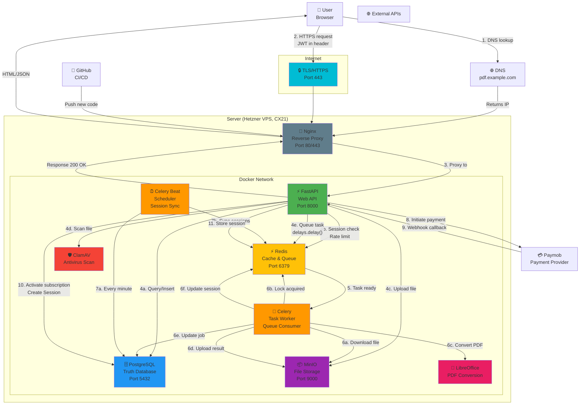

# Module 1: Architecture Overview

## Complete System Diagram



## The 8 Core Services

### 1. **Nginx** (Reverse Proxy)
**What**: Traffic router for the entire system.

**Handles**:
- TLS/HTTPS termination (decrypts port 443)
- HTTP → HTTPS redirect
- Rate limiting (prevent brute force)
- Static file serving (gzipped)
- Proxies dynamic requests to FastAPI

**Lives**: Port 80 (HTTP), 443 (HTTPS)

**Why not just FastAPI on port 443?**
- FastAPI doesn't handle TLS efficiently
- Nginx is battle-tested, optimized for serving
- Separation of concerns (web server vs app server)

---

### 2. **FastAPI** (Web Application)
**What**: Your business logic.

**Handles**:
- `POST /auth/login` → Validate credentials, return JWT
- `POST /upload` → Accept file, scan, queue conversion
- `GET /jobs/{id}/status` → Return job status + presigned URL
- `POST /payments/initiate` → Call Paymob API
- `POST /payments/webhook` → Receive payment confirmation
- Rate limiting, CORS, input validation

**Lives**: Port 8000

**Why FastAPI?**
- Fast (Starlette is async)
- Type hints (Pydantic validation)
- Auto-generated OpenAPI docs
- Production-ready (Uvicorn ASGI server)

---

### 3. **PostgreSQL** (Truth Database)
**What**: Single source of truth for all persistent data.

**Stores**:
- Users (id, email, password_hash, subscription_id)
- Subscriptions (user_id, plan, is_active, expires_at)
- Files (user_id, filename, size, status, uploaded_at)
- Jobs (file_id, status, error, started_at, completed_at)
- Payments (user_id, amount, status, paymob_ref, created_at)

**Lives**: Port 5432 (internal)

**Why PostgreSQL?**
- ACID guarantees (money is involved)
- Relationships matter (users → subscriptions → files)
- Full-text search (search uploaded files)
- JSON support (metadata)

---

### 4. **Redis** (Speed Layer)
**What**: Fast cache + message broker.

**Stores**:
- **Sessions**: `session:{user_id}:start`, `session:{user_id}:files` (60-min TTL)
- **Rate limits**: `ratelimit:ip:{ip}:count` (auto-reset hourly)
- **JWT blacklist**: `jwt:blacklist:{token_hash}` (on logout)
- **Task queue**: `celery` queues (FIFO)
- **Locks**: `lock:conversion:{job_id}` (distributed)

**Lives**: Port 6379 (internal)

**Why Redis?**
- In-memory (subsecond response)
- TTL built-in (sessions auto-expire)
- Pub/Sub (real-time notifications)
- Atomic operations (transactions)

---

### 5. **Celery Worker** (Background Tasks)
**What**: Executes long-running tasks without blocking the user.

**Handles**:
- PDF conversion (5-30 seconds, blocks on LibreOffice)
- Image thumbnail generation
- Email sending
- Database cleanup
- Retries failed tasks

**Lives**: Inside Docker, consumes from Redis queue

**Why Celery?**
- User doesn't wait for 30-second conversion
- Can run multiple workers (parallel processing)
- Automatic retries (task fails? Retry 3 times)
- Dead letter queue (failed tasks inspectable)

---

### 6. **Celery Beat** (Scheduler)
**What**: Runs recurring tasks on a schedule.

**Schedule**:
- Every 1 minute: Sync Redis sessions to PostgreSQL (durability)
- Every 24 hours: Delete expired sessions
- Every 7 days: Cleanup old files (free plan limit)

**Why Celery Beat?**
- Distributed (survives application restart)
- Lightweight (one task per minute)
- Easy to add/remove scheduled jobs

---

### 7. **MinIO** (File Storage)
**What**: Object storage (like S3, but local).

**Stores**:
- Input PDFs: `input-files/user-123/uuid.pdf`
- Converted images: `output-files/user-123/uuid/page-1.png`
- Temporary files: `temp/uuid.txt` (auto-cleanup)

**Lives**: Port 9000 (internal)

**Why MinIO?**
- S3-compatible (easy migration to AWS S3)
- No local filesystem (scales horizontally)
- Built-in versioning
- Presigned URLs (users download directly)

---

### 8. **Support Services**

#### ClamAV (Antivirus)
Scans uploaded files for malware. Blocks if infected.

#### LibreOffice (Conversion)
Converts PDF → PNG/JPEG using headless mode. Isolated in separate container to prevent crashes.

---

## Data Flow Map

```
┌─────────────────────────────────────────────────────┐
│                  Data Residency                      │
├─────────────────────────────────────────────────────┤
│                                                      │
│  PostgreSQL (Persistent Truth)                      │
│  ├─ Users                                           │
│  ├─ Subscriptions                                   │
│  ├─ Files                                           │
│  ├─ Jobs                                            │
│  └─ Payments                                        │
│                                                      │
│  Redis (Cache & Queue, TTL-based)                   │
│  ├─ Active sessions (60 min)                        │
│  ├─ Rate limits (1 hour)                            │
│  ├─ JWT blacklist (token lifetime)                  │
│  ├─ Task queue (picked up by workers)               │
│  └─ Locks (conversion in progress)                  │
│                                                      │
│  MinIO (Object Storage)                             │
│  ├─ Input PDFs (raw uploads)                        │
│  ├─ Output images (converted results)               │
│  └─ Temporary working files                         │
│                                                      │
└─────────────────────────────────────────────────────┘
```

---

## Request Flow Map

```
                        www.pdf-platform.com
                              │
                    ┌─────────┼─────────┐
                    ↓         ↓         ↓
              GET /    POST /upload  GET /jobs/{id}
            (Frontend) (Form Data)  (Poll Status)
                │         │          │
                ├─→ Nginx ←┤          │
                │         │          │
                ↓         ↓          ↓
         ┌────────────────────────────────────┐
         │        FastAPI Routes               │
         ├────────────────────────────────────┤
         │ /auth/login          → db query    │
         │ /auth/logout         → redis del   │
         │ /upload              → db + redis  │
         │ /jobs/{id}/status    → db query    │
         │ /payments/initiate   → paymob api  │
         │ /payments/webhook    → db update   │
         │ /health              → ok (200)    │
         └────────────────────────────────────┘
```

---

## Why Each Tool Was Chosen

| Tool | Alternative | Why We Chose It |
|---|---|---|
| **FastAPI** | Django, Flask, Node.js | Fastest Python web framework, type hints, auto OpenAPI docs |
| **PostgreSQL** | MongoDB, MySQL | ACID, relationships, full-text search, JSON support |
| **Redis** | Memcached, RabbitMQ | In-memory + broker + pub/sub all in one, Celery integrates seamlessly |
| **Celery** | APScheduler, Huey | Industry standard, retries, dead letter queues, remote workers |
| **MinIO** | Local filesystem, FTP | S3-compatible (easy AWS migration), scalable, no filesystem limits |
| **Nginx** | HAProxy, Caddy | Lightweight, proven, excellent TLS support |
| **LibreOffice** | ImageMagick, Ghostscript | PDF → images, free, headless mode available |
| **ClamAV** | AVG, McAfee | Free, open-source, community updated definitions |

---

## Cost Breakdown (Hetzner VPS)

```
Hetzner CX21 VPS:        €8.50/month
├─ 4 CPU cores
├─ 8GB RAM
├─ 160GB NVMe SSD
└─ Unlimited traffic

Total:                    €8.50/month (~$10 USD)

This covers:
✓ Nginx + FastAPI
✓ PostgreSQL + Redis
✓ Celery Worker + Beat
✓ MinIO for up to 1TB files
✓ LibreOffice + ClamAV
```

Running on dedicated AWS would cost $200-500/month (if scaling). Hetzner is extremely cost-effective.

---

## Next: Everything in Motion

Module 2 shows a real HTTP request from browser to response — every step.
