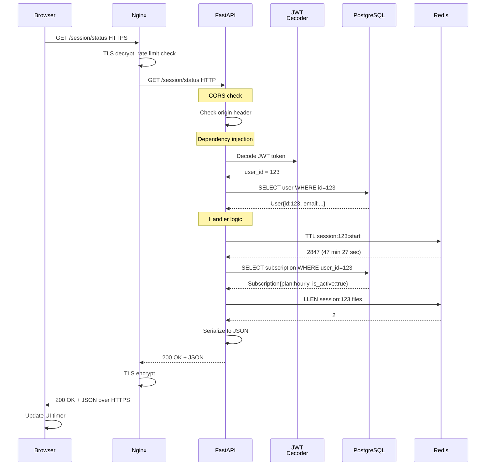

# Module 2: The Request Lifecycle

## One Request, Step by Step

Let's trace a single HTTP request: **GET /session/status** (user checks remaining time in 1-hour window).

User is logged in. JWT is in `Authorization: Bearer eyJ0eXAi...`.

### Request Arrives at Nginx

```
User → Browser → HTTPS POST
  Host: pdf-platform.example.com
  Port: 443
  Headers:
    Authorization: Bearer eyJ0eXAi...
    Accept: application/json
  Body: (empty for GET)
```

**Step 1: Nginx receives on port 443**
- TLS handshake (client sends cert request, server sends cert + key)
- TLS record layer decrypts the plaintext HTTP request
- Nginx sees the unencrypted GET request

**Step 2: Nginx rate limiting**
```nginx
# /etc/nginx/nginx.conf
limit_req_zone $binary_remote_addr zone=api:10m rate=100r/s;

server {
    listen 443 ssl;
    location /session/ {
        limit_req zone=api;
        proxy_pass http://fastapi:8000;
    }
}
```

- Extract client IP (e.g., `203.0.113.45`)
- Check Redis counter: `ratelimit:ip:203.0.113.45:count`
- If count < 100/sec in last second: allow
- If count >= 100/sec: return 429 Too Many Requests
- Assume: allowed ✓

**Step 3: Nginx proxies to FastAPI**
```nginx
proxy_pass http://fastapi:8000;
proxy_set_header Authorization $http_authorization;
proxy_set_header X-Real-IP $remote_addr;
```

Headers sent to FastAPI:
- `Authorization: Bearer eyJ0eXAi...` (preserved)
- `X-Real-IP: 203.0.113.45` (for rate limiting inside FastAPI too)

---

### Request Enters FastAPI

```
GET /session/status HTTP/1.1
Host: pdf-platform.example.com
Authorization: Bearer eyJ0eXAi...
```

**Step 4: CORS middleware**

FastAPI first middleware: `CORSMiddleware`

```python
from fastapi.middleware.cors import CORSMiddleware

app.add_middleware(
    CORSMiddleware,
    allow_origins=["https://pdf-platform.example.com", "localhost:3000"],
    allow_credentials=True,
    allow_methods=["GET", "POST", "PUT", "DELETE"],
    allow_headers=["*"],
)
```

- Check request origin header: `https://pdf-platform.example.com`
- Is origin in `allow_origins` list? Yes ✓
- Add response header: `Access-Control-Allow-Origin: https://pdf-platform.example.com`

**Step 5: Route matching**

FastAPI checks routes:
```python
@app.get("/session/status")
async def get_session_status(current_user: User = Depends(get_current_user)):
    ...
```

Route found ✓ → Execute handler

**Step 6: Dependency chain**

Before handler code runs, FastAPI processes `Depends(get_current_user)`:

```python
def get_current_user(token: str = Depends(oauth2_scheme)) -> User:
    """
    This dependency runs before the handler.
    If it fails, never reach the handler.
    """
    try:
        payload = jwt.decode(
            token,
            SECRET_KEY,
            algorithms=["HS256"]
        )
        user_id: int = payload.get("sub")
        if user_id is None:
            raise HTTPException(status_code=401, detail="Invalid token")
    except JWTError:
        raise HTTPException(status_code=401, detail="Invalid token")
    
    user = db.query(User).filter(User.id == user_id).first()
    if not user:
        raise HTTPException(status_code=404, detail="User not found")
    
    return user
```

Sub-steps:
1. Extract JWT from `Authorization: Bearer eyJ0eXAi...`
2. Decode JWT using `SECRET_KEY`
3. Extract `sub` claim (user_id = 123)
4. Query PostgreSQL: `SELECT * FROM users WHERE id = 123`
5. Return User object

**Dependency injection successful** ✓ `current_user = User(id=123, email="user@example.com", ...)`

---

### Handler Code Runs

```python
@app.get("/session/status")
async def get_session_status(current_user: User = Depends(get_current_user)):
    """Get remaining time in user's current session."""
    
    # Step 7: Check Redis for session TTL
    user_id = current_user.id
    session_key = f"session:{user_id}:start"
    
    # Query Redis
    remaining_ttl = redis.ttl(session_key)
    # TTL returns seconds remaining
    # -2 = key doesn't exist
    # -1 = key exists, no expiry
    
    if remaining_ttl == -2:
        # No active session
        return {
            "has_session": False,
            "remaining_seconds": 0,
            "remaining_formatted": "00:00:00"
        }
    
    # Step 8: Query database for session metadata
    subscription = db.query(Subscription).filter(
        Subscription.user_id == user_id,
        Subscription.is_active == True
    ).first()
    
    if not subscription:
        return {
            "has_session": False,
            "remaining_seconds": 0,
            "reason": "No active subscription"
        }
    
    # Step 9: Get files uploaded in this session
    files_queued = redis.llen(f"session:{user_id}:files")
    
    # Return response
    remaining_seconds = remaining_ttl
    hours = remaining_seconds // 3600
    minutes = (remaining_seconds % 3600) // 60
    seconds = remaining_seconds % 60
    
    return {
        "has_session": True,
        "subscription_plan": subscription.plan,  # "hourly" or "daily"
        "remaining_seconds": remaining_seconds,
        "remaining_formatted": f"{hours:02d}:{minutes:02d}:{seconds:02d}",
        "files_uploaded_this_session": files_queued,
        "expires_at_iso": datetime.now() + timedelta(seconds=remaining_seconds)
    }
```

**Sequence of data access**:
1. Redis: `TTL session:123:start` (instant, <1ms)
2. PostgreSQL: `SELECT * FROM subscriptions WHERE user_id=123 AND is_active=true` (~5ms)
3. Redis: `LLEN session:123:files` (instant, <1ms)

Total response time: ~10-20ms

---

### Response Serialization

Pydantic serializes the response:

```python
from pydantic import BaseModel

class SessionStatus(BaseModel):
    has_session: bool
    subscription_plan: str
    remaining_seconds: int
    remaining_formatted: str
    files_uploaded_this_session: int
    expires_at_iso: datetime

# Response automatically converted to JSON
return SessionStatus(
    has_session=True,
    subscription_plan="hourly",
    ...
)
```

FastAPI adds headers:
```
HTTP/1.1 200 OK
Content-Type: application/json
Content-Length: 234
Date: Mon, 15 Jan 2024 10:30:45 GMT

{
  "has_session": true,
  "subscription_plan": "hourly",
  "remaining_seconds": 2847,
  "remaining_formatted": "00:47:27",
  "files_uploaded_this_session": 2,
  "expires_at_iso": "2024-01-15T11:17:12"
}
```

---

### Response Returns to Nginx

```
Nginx ← 200 OK JSON from FastAPI:8000
    (re-encrypts with TLS)
    ↓
Browser ← 200 OK JSON (over HTTPS)
    (JavaScript receives, updates UI)
    ↓
User sees: "Time remaining: 00:47:27" ✓
```

---

## Complete Sequence Diagram



---

## Troubleshooting: What If This Request Fails?

| Symptom | HTTP Status | Diagnosis Command | Fix |
|---------|-------------|-------------------|-----|
| **User sees 401 Unauthorized** | 401 | Check JWT: `echo $TOKEN \| jq` | User needs to login again (`/auth/login`) |
| **User sees 429 Too Many Requests** | 429 | Check rate limit: `redis-cli GET ratelimit:ip:203.0.113.45:count` | Wait 1 second, retry. Or increase rate limit in nginx.conf |
| **CORS error in browser console** | (no request sent) | Browser log: "Cross-Origin Request Blocked" | Add origin to `allow_origins` in FastAPI |
| **500 Internal Server Error** | 500 | FastAPI logs: `docker logs api` | Check PostgreSQL connection, check token SECRET_KEY |
| **Timeout (60+ seconds)** | 504 | PostgreSQL slow query: `SELECT version();` takes 30s | Restart PostgreSQL or increase pool size |
| **Invalid JWT claims** | 401 | Decode token: `python3 -c "import jwt; print(jwt.decode(...))"` | Token expired (TTL exceeded). User needs new token. |

---

## Key Takeaways

- **Request lifecycle** = Nginx → FastAPI dependencies → handler → serialization → response
- **Rate limiting** = two layers (Nginx + FastAPI)
- **Dependency injection** = FastAPI runs dependencies before handler (e.g., JWT verification)
- **Cache hit** = Redis TTL lookup (<1ms)
- **DB hit** = PostgreSQL query (~5ms)
- **Total time** = ~20ms (browser perceives instant)
- **Failure points** = TLS, rate limit, JWT decode, DB connection, Redis connection

Next module: Trace the entire file upload and conversion pipeline.
