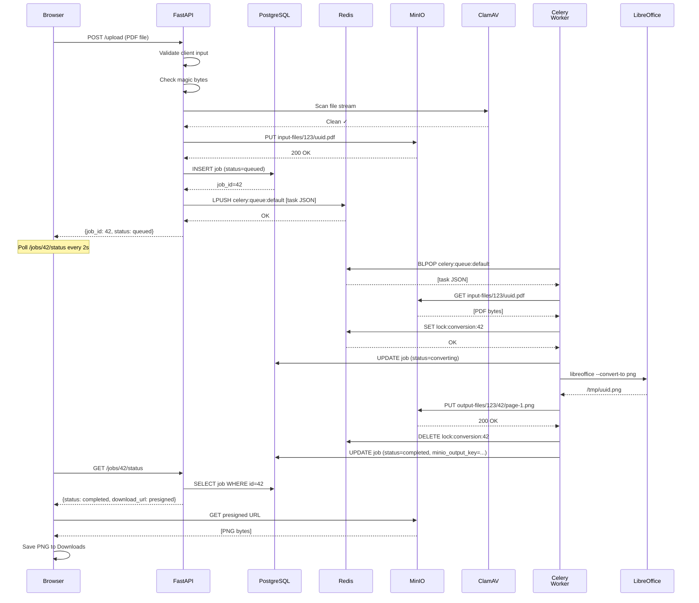

# Module 3: The Upload and Conversion Pipeline

## Complete End-to-End Trace

User drags a PDF onto the web UI. 60 seconds later, it's converted to PNG images and ready for download.

Here's every step:

### Step 1-2: Client Validation

```javascript
// React frontend
const handleFileDropped = (file) => {
  // Client-side validation (instant feedback)
  if (file.size > 100 * 1024 * 1024) {  // 100MB max
    alert("File too large");
    return;
  }
  
  if (!file.type.includes("pdf")) {
    alert("Must be PDF");
    return;
  }
  
  uploadFile(file); // Proceed to server
};

const uploadFile = async (file) => {
  const formData = new FormData();
  formData.append("file", file);
  
  // POST with JWT header
  const response = await fetch("/upload", {
    method: "POST",
    headers: {
      "Authorization": `Bearer ${localStorage.getItem("jwt")}`
    },
    body: formData
  });
  
  const json = await response.json();
  console.log(json);  // {job_id: "uuid123", status: "queued"}
};
```

---

### Step 3: POST /upload Arrives at Server

```
POST /upload HTTP/1.1
Content-Type: multipart/form-data; boundary=...
Authorization: Bearer eyJ0eXAi...
X-Real-IP: 203.0.113.45

[Binary PDF data, 15MB]
```

**Step 4: Nginx rate limiting (upload rate)**

```nginx
# /etc/nginx/nginx.conf
limit_req_zone $binary_remote_addr zone=upload:10m rate=5r/s;

location /upload {
    # Max 5 uploads per second per IP
    limit_req zone=upload;
    client_max_body_size 100M;  # Allow 100MB uploads
    proxy_pass http://fastapi:8000;
}
```

Check: `ratelimit:ip:203.0.113.45:upload:count`
- If < 5 in this second: allow ✓
- Nginx forwards request to FastAPI

---

### Step 5-6: FastAPI Dependencies

```python
@app.post("/upload")
async def upload_file(
    file: UploadFile = File(),
    current_user: User = Depends(get_current_user),
    subscription: Subscription = Depends(require_active_subscription),
):
    """
    Dependency 1: get_current_user
    - Decode JWT → user_id=123
    - Query database → User found ✓
    
    Dependency 2: require_active_subscription
    - Query PostgreSQL subscription for user 123
    - Check is_active=true
    - Check plan (free, hourly, daily)
    - If not active: raise HTTPException(403, "No active subscription")
    """
```

Both dependencies pass ✓ Continue to handler.

---

### Step 7: Magic Byte Validation

```python
import magic

async def upload_file(...):
    # Read first 4KB of file
    chunk = await file.read(4096)
    await file.seek(0)  # Rewind for later reading
    
    # Check magic bytes (file type signature)
    mime = magic.from_buffer(chunk, mime=True)
    # PDF magic: %PDF-1.4
    
    if mime != "application/pdf":
        raise HTTPException(400, f"Not a PDF: {mime}")
    
    # Add to request state for later
    request.state.file_size = len(chunk)
```

**Why**: Filename can lie. `malware.exe` renamed to `document.pdf` would pass `file.type` check in browser. Magic bytes don't lie.

---

### Step 8: ClamAV Antivirus Scan

```python
import pyclamd

async def upload_file(...):
    # ClamAV daemon running in separate container
    clam = pyclamd.ClamD("localhost:3310")
    
    # Stream file to ClamAV
    is_infected = await clam.scan_stream(file.file)
    
    if is_infected:
        await file.close()
        raise HTTPException(400, "File infected - refused")
    
    # File is safe ✓
```

---

### Step 9: Upload to MinIO

```python
import boto3

async def upload_file(...):
    # MinIO S3-compatible client
    s3 = boto3.client(
        "s3",
        endpoint_url="http://minio:9000",
        aws_access_key_id="minioadmin",
        aws_secret_access_key="minioadmin",
        region_name="us-east-1"
    )
    
    # Generate unique key (prevents overwrites)
    import uuid
    file_key = f"input-files/{current_user.id}/{uuid.uuid4()}.pdf"
    
    # Upload to MinIO
    s3.put_object(
        Bucket="uploads",
        Key=file_key,
        Body=await file.read(),
        ContentType="application/pdf"
    )
    
    # MinIO returns 200 OK
    # File now stored: uploads/input-files/123/abc-def-ghi.pdf
```

---

### Step 10: Create Job Record in PostgreSQL

```python
from sqlalchemy import insert
from models import Job

async def upload_file(...):
    job = Job(
        user_id=current_user.id,
        filename=file.filename,
        minio_key=file_key,
        status="queued",  # Will be updated by worker
        uploaded_at=datetime.now(),
        page_count=None,  # Worker will calculate
        conversion_started_at=None,
        conversion_completed_at=None
    )
    
    db.add(job)
    db.commit()
    db.refresh(job)  # Get auto-generated job.id
    
    # Database now has:
    # id=42, user_id=123, status=queued, minio_key=..., created_at=now
```

---

### Step 11: Queue Task to Redis

```python
from celery_app import app as celery_app

async def upload_file(...):
    # Push task to Redis queue
    task = convert_pdf_task.delay(
        job_id=job.id,
        user_id=current_user.id,
        minio_key=file_key
    )
    
    # Celery serializes task to JSON:
    # {
    #   "id": "task-uuid-123",
    #   "task": "tasks.convert_pdf_task",
    #   "args": [42],
    #   "kwargs": {"job_id": 42, "user_id": 123, "minio_key": "..."}
    # }
    
    # Task pushed to Redis:
    # LPUSH celery:queue:default [JSON blob]
    
    # If task fails, Redis has it (durability)
    
    return {
        "job_id": job.id,
        "status": "queued",
        "message": "Your file is being converted. Poll /jobs/{}/status to check."
    }
```

**Response sent back to browser (instant)**:
```json
{
  "job_id": 42,
  "status": "queued"
}
```

User sees "Converting..." spinner, starts polling.

---

### Step 12-18: Celery Worker Processes Task

Separately, a Celery worker is running:

```bash
$ celery -A tasks worker --loglevel=info
[*] Connected to redis://redis:6379
[*] Waiting for tasks...
```

**Step 12: Worker picks up from queue**

```python
redis.blpop("celery:queue:default", timeout=1)
# Blocks until task available
# Gets: [JSON task blob]
# Parses task → job_id=42, etc.
```

**Step 13: Task handler runs**

```python
@celery_app.task(bind=True, max_retries=3)
def convert_pdf_task(self, job_id, user_id, minio_key):
    """
    Convert PDF to PNG images.
    
    If fails, Celery retries up to 3 times.
    If fails 3 times, goes to dead letter queue.
    """
    
    try:
        # Step 13a: Download file from MinIO
        s3 = boto3.client("s3", endpoint_url="http://minio:9000", ...)
        
        pdf_bytes = s3.get_object(Bucket="uploads", Key=minio_key)["Body"].read()
        
        # Save temp file
        temp_pdf = f"/tmp/{uuid.uuid4()}.pdf"
        with open(temp_pdf, "wb") as f:
            f.write(pdf_bytes)
        
        # Update job status
        job = db.query(Job).filter(Job.id == job_id).first()
        job.conversion_started_at = datetime.now()
        job.status = "converting"
        db.commit()
```

**Step 13b: Acquire distributed lock (prevent parallel conversion)**

```python
        #If multiple workers try to convert same file, only one succeeds
        lock_key = f"lock:conversion:{job_id}"
        
        # Try to acquire lock (will fail if another worker has it)
        lock_acquired = redis.set(
            lock_key,
            value="worker-1",
            nx=True,  # Only set if NOT exists
            ex=300    # Auto-release after 5 min
        )
        
        if not lock_acquired:
            # Another worker is converting this file
            # Retry this task later
            raise self.retry(countdown=10)
```

**Step 13c: Run LibreOffice conversion**

```python
        # LibreOffice in separate container
        subprocess.run([
            "libreoffice",
            "--headless",
            "--convert-to", "png",
            "--outdir", "/tmp",
            temp_pdf
        ], timeout=60, check=True)
        
        # Output: /tmp/{uuid}.png (1 page = 1 PNG)
        
        # Read generated PNG
        output_png = f"/tmp/{uuid.uuid4()}.png"
        with open(output_png, "rb") as f:
            png_bytes = f.read()
```

**Step 13d: Upload result to MinIO**

```python
        output_key = f"output-files/{user_id}/{job_id}/page-1.png"
        
        s3.put_object(
            Bucket="downloads",
            Key=output_key,
            Body=png_bytes,
            ContentType="image/png"
        )
```

**Step 13e: Release lock**

```python
        redis.delete(lock_key)
```

**Step 13f: Update job status in PostgreSQL**

```python
        job.status = "completed"
        job.conversion_completed_at = datetime.now()
        job.page_count = 1
        job.minio_output_key = output_key
        db.commit()
        
        # Task succeeded ✓
        return {"job_id": job_id, "status": "completed"}
    
    except Exception as e:
        # LOG ERROR
        logger.error(f"Conversion failed: {e}")
        
        # UPDATE JOB
        job.status = "error"
        job.error_message = str(e)
        db.commit()
        
        # RETRY (max 3 times)
        if self.request.retries < self.max_retries:
            # Retry after 30 seconds
            raise self.retry(exc=e, countdown=30)
        else:
            # Max retries exceeded → goes to DLQ
            raise
```

---

### Step 19-20: Frontend Detects Completion

Frontend polls `/jobs/42/status` every 2 seconds:

```javascript
const pollJobStatus = async (jobId) => {
  while (true) {
    const response = await fetch(`/jobs/${jobId}/status`, {
      headers: { "Authorization": `Bearer ${token}` }
    });
    const json = await response.json();
    
    if (json.status === "completed") {
      // Stop polling, show download button
      console.log("Ready!");
      console.log("Download URL:", json.download_url);
      break;
    }
    
    if (json.status === "error") {
      console.error(json.error);
      break;
    }
    
    // Still converting, wait 2 seconds
    await new Promise(resolve => setTimeout(resolve, 2000));
  }
};
```

---

### Step 21: Download from MinIO

```python
@app.get("/jobs/{job_id}/status")
async def get_job_status(
    job_id: int,
    current_user: User = Depends(get_current_user)
):
    job = db.query(Job).filter(
        Job.id == job_id,
        Job.user_id == current_user.id
    ).first()
    
    if job.status == "completed":
        # Generate presigned URL (valid for 1 hour)
        presigned_url = s3.generate_presigned_url(
            "get_object",
            Params={
                "Bucket": "downloads",
                "Key": job.minio_output_key
            },
            ExpiresIn=3600
        )
        
        return {
            "status": "completed",
            "download_url": presigned_url
        }
    
    return {
        "status": job.status,
        "created_at": job.uploaded_at
    }
```

User clicks download link → browser fetches directly from MinIO → PNG saves to Downloads folder.

---

## Complete Sequence Diagram



---

## Troubleshooting: Pipeline Breaks

| Step | Symptom | Diagnosis | Fix |
|------|---------|-----------|-----|
| **Upload** | "File not accepted" | Check browser console: magic bytes/size | Frontend validation only (harmless) |
| **ClamAV scan** | Upload hangs 60s | `curl http://localhost:3310` | Restart ClamAV: `docker restart clamav` |
| **MinIO upload** | 503 Service Unavailable | `docker logs minio` | MinIO disk full or crashed. Check `/data` size |
| **Job queued, never starts** | Status stuck on "queued" 10+ min | `redis-cli LLEN celery` | Celery worker not running. `docker logs worker` |
| **Worker crashes** | Job status → "error", error_message → timeout | Worker logs: `docker logs worker` | LibreOffice memory leak. Increase worker RAM or restart |
| **Conversion stuck** | status=converting for 5+ minutes | `redis-cli KEYS lock:conversion:*` | Lock acquired but worker died. Manual fix: `redis-cli DEL lock:conversion:42` |
| **Can't download** | Presigned URL invalid | `aws s3 ls s3://downloads/output-files/123/42/` | MinIO key doesn't exist. Check output from worker. |

---

## Key Timeline

- **Upload to DB insert**: ~500ms
- **Task queued**: ~50ms
- **Worker picks up**: 0-1s (depends on worker availability)
- **Download from MinIO**: 100ms
- **LibreOffice conversion**: 5-30s (depends on PDF size)
- **Upload result to MinIO**: 100-500ms
- **Total pipeline**: 6-35 seconds (usually ~15s for 10MB PDF)

Next module: How payment and subscription activation work.
