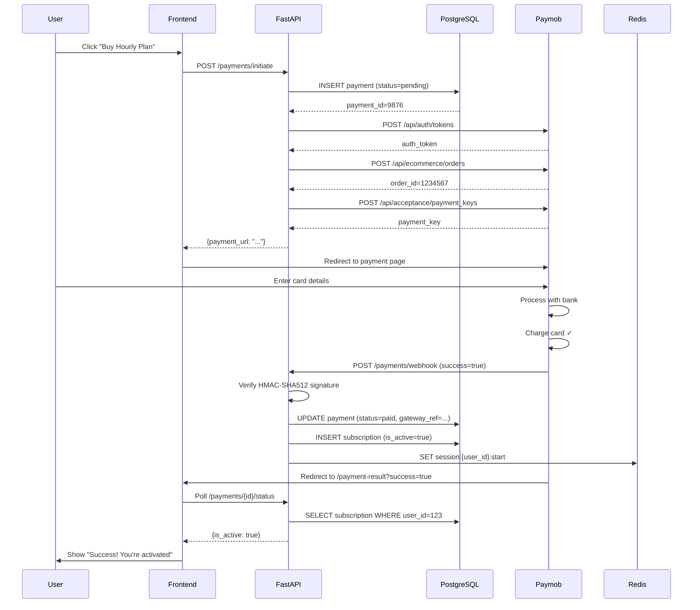

# Module 4: The Payment and Subscription Flow

## Complete Payment Lifecycle

User clicks "Buy Hourly Plan" on pricing page. Card is charged. Subscription activated. Let's trace every step.

---

## Step 1-2: Frontend Initiates Payment

```javascript
// React pricing page
const handleBuyPlan = async (planId) => {
  // planId = "hourly" or "daily"
  
  // Show "Processing..." modal
  setLoading(true);
  
  // Call backend to initiate payment
  const response = await fetch("/payments/initiate", {
    method: "POST",
    headers: {
      "Authorization": `Bearer ${localStorage.getItem("jwt")}`,
      "Content-Type": "application/json"
    },
    body: JSON.stringify({ plan_id: planId })
  });
  
  const json = await response.json();
  // json = { payment_url: "https://payments.paymob.com/?token=...", ... }
  
  // Redirect user to Paymob's payment page
  window.location.href = json.payment_url;
};
```

---

## Step 3: FastAPI Creates Payment Record

```python
@app.post("/payments/initiate")
async def initiate_payment(
    plan_id: str,
    current_user: User = Depends(get_current_user)
):
    """
    Step 3: Create payment record in PostgreSQL.
    This record tracks the payment through all stages.
    """
    
    # Validate plan
    plan_info = {
        "hourly": {"price_egp": 2900},  # 29 EGP
        "daily": {"price_egp": 9900}    # 99 EGP
    }
    
    if plan_id not in plan_info:
        raise HTTPException(400, "Invalid plan")
    
    # Create payment record (status=pending)
    payment = Payment(
        user_id=current_user.id,
        plan_id=plan_id,
        price_egp=plan_info[plan_id]["price_egp"],
        status="pending",  # Will update after webhook
        created_at=datetime.now()
    )
    
    db.add(payment)
    db.commit()
    db.refresh(payment)
    
    # Now payment.id exists in database
    # payment_id = 9876
    
    return initiate_paymob_payment(
        payment_id=payment.id,
        user_id=current_user.id,
        amount_egp=plan_info[plan_id]["price_egp"],
        plan_id=plan_id
    )
```

---

## Step 4-6: Call Paymob API (3-Step Process)

Paymob requires 3 API calls before redirecting to payment page.

```python
def initiate_paymob_payment(payment_id, user_id, amount_egp, plan_id):
    """
    Paymob workflow:
    1. Get auth token
    2. Create order (get order_id)
    3. Get payment_key (redirect token)
    """
    
    # Configuration
    PAYMOB_API_KEY = os.getenv("PAYMOB_API_KEY")
    PAYMOB_INTEGR_ID = os.getenv("PAYMOB_INTEGR_ID")  # Integration ID
    MERCHANT_ORDER_ID = f"order-{payment_id}"
    
    # Step 4: Get auth token
    # POST https://accept.paymob.com/api/auth/tokens
    
    response_1 = requests.post(
        "https://accept.paymob.com/api/auth/tokens",
        json={"api_key": PAYMOB_API_KEY},
        timeout=10
    )
    
    auth_token = response_1.json()["token"]
    # auth_token = "ZXlKaGJHY2lPaUpJ..."
    
    # Step 5: Create order
    # POST https://accept.paymob.com/api/ecommerce/orders
    
    response_2 = requests.post(
        "https://accept.paymob.com/api/ecommerce/orders",
        json={
            "auth_token": auth_token,
            "delivery_needed": False,
            "merchant_order_id": MERCHANT_ORDER_ID,
            "amount_cents": amount_egp * 100,  # Convert to cents
            "currency": "EGP",
            "items": [
                {
                    "name": f"{plan_id.title()} Plan",
                    "amount_cents": amount_egp * 100,
                    "quantity": "1",
                    "description": "PDF conversion subscription"
                }
            ]
        },
        timeout=10
    )
    
    order_data = response_2.json()
    order_id = order_data["id"]  # order_id = 1234567
    
    # Step 6: Get payment key for redirect
    # POST https://accept.paymob.com/api/acceptance/payment_keys
    
    response_3 = requests.post(
        "https://accept.paymob.com/api/acceptance/payment_keys",
        json={
            "auth_token": auth_token,
            "amount_cents": amount_egp * 100,
            "expiration": 3600,  # Valid 1 hour
            "order_id": order_id,
            "billing_data": {
                "apartment": "NA",
                "email": current_user.email,
                "floor": "NA",
                "first_name": current_user.name,
                "street": "NA",
                "postal_code": "NA",
                "city": "NA",
                "country": "EG",
                "last_name": "User",
                "phone_number": "+20100000000"
            },
            "currency": "EGP",
            "integration_id": PAYMOB_INTEGR_ID
        },
        timeout=10
    )
    
    payment_key = response_3.json()["token"]
    # payment_key = "ZXlKaGJHY2lPaUpJ..."
    
    # Step 7: Return payment page URL to frontend
    payment_url = f"https://accept.paymob.com/api/acceptance/iframes/1234567?payment_token={payment_key}"
    
    return {
        "payment_url": payment_url,
        "payment_id": payment_id,
        "order_id": order_id
    }
```

---

## Step 8: User Enters Card Details

User redirected to `https://accept.paymob.com/...`:

```
┌─────────────────────────────────┐
│ Paymob Hosted Payment Page       │
├─────────────────────────────────┤
│                                  │
│ Card Number:  [4111 1111 1111]  │
│ Exp Date:     [12 / 25]         │
│ CVV:          [123]             │
│                                  │
│        [ Pay 2900 EGP ]          │
│                                  │
└─────────────────────────────────┘
```

**Key**: Paymob handles the payment page. Your server never sees the card number (PCI compliance).

---

## Step 9: Paymob Processes Payment with Bank

```
User on Paymob page
    ↓
User clicks "Pay"
    ↓
Paymob → Bank (3D Secure if needed)
    ↓
Bank → Card issuer (validate card, charge)
    ↓
Card issuer → Paymob (success, transaction_id=...)
    ↓
Paymob has payment confirmation
```

---

## Step 10-12: Paymob Sends Webhook

After payment succeeds, Paymob sends a webhook to your server:

```
Paymob →  POST https://your-domain.com/payments/webhook
  {
    "type": "TRANSACTION",
    "obj": {
      "id": 123456789,
      "gateway_ref": "12345",
      "amount_cents": 290000,
      "success": true,
      "error_message": null,
      "acquirer_message": "Approved",
      "status": "SUCCESS",
      "created_at": "2024-01-15T10:30:00Z",
      "merchant_order_id": "order-9876",
      "order": {
        "id": 1234567,
        "amount_cents": 290000
      }
    }
  }
```

**Step 10: FastAPI receives webhook**

```python
@app.post("/payments/webhook")
async def payment_webhook(request: Request):
    """
    Receiving webhook from Paymob.
    Must verify signature (HMAC-SHA512).
    """
```

**Step 11: Verify webhook signature (security critical)**

```python
    import hmac
    import hashlib
    
    body = await request.body()
    
    # Get signature from header
    signature_header = request.headers.get("X-Paymob-Signature")
    
    # Recalculate signature
    PAYMOB_API_KEY = os.getenv("PAYMOB_API_KEY")
    calculated_signature = hmac.new(
        key=PAYMOB_API_KEY.encode(),
        msg=body,
        digestmod=hashlib.sha512
    ).hexdigest()
    
    # Compare (constant-time to prevent timing attacks)
    if not hmac.compare_digest(signature_header, calculated_signature):
        # FORGED WEBHOOK! Someone is trying to trick us
        logger.warning(f"Forged webhook rejected")
        return {"ok": False}, 403
    
    # Signature valid ✓
    
    # Parse webhook
    data = await request.json()
    
    # Extract fields
    is_success = data["obj"]["success"]
    gateway_ref = data["obj"]["gateway_ref"]
    merchant_order_id = data["obj"]["merchant_order_id"]
    amount_cents = data["obj"]["amount_cents"]
    
    # Extract payment_id from merchant_order_id
    # merchant_order_id = "order-9876" → payment_id = 9876
    payment_id = int(merchant_order_id.split("-")[1])
```

**Step 12: Update payment record in database (idempotency check)**

```python
    # Idempotency check (Paymob might send webhook twice)
    # Check if this payment_id + gateway_ref combo exists
    
    existing_payment = db.query(Payment).filter(
        Payment.id == payment_id,
        Payment.gateway_ref == gateway_ref
    ).first()
    
    if existing_payment:
        # Already processed this webhook
        logger.info(f"Duplicate webhook for payment {payment_id}")
        return {"ok": True}  # Acknowledge but don't process twice
    
    # New payment → process it
    
    payment = db.query(Payment).filter(Payment.id == payment_id).first()
    
    if not payment:
        logger.error(f"Payment {payment_id} not found")
        return {"ok": False}, 404
    
    if not is_success:
        # Payment failed
        payment.status = "failed"
        payment.error_message = data["obj"]["error_message"]
        db.commit()
        return {"ok": True}
    
    # Payment succeeded ✓
    payment.status = "paid"
    payment.gateway_ref = gateway_ref
    payment.paid_at = datetime.now()
    db.commit()
    
    # Step 13-14: Create/update subscription
    create_subscription_from_payment(payment)
    
    return {"ok": True}
```

---

## Step 13-14: Create/Activate Subscription

```python
def create_subscription_from_payment(payment):
    """
    User paid → activate subscription.
    """
    
    # Delete any previous subscriptions
    db.query(Subscription).filter(
        Subscription.user_id == payment.user_id
    ).delete()
    
    # Create new subscription
    if payment.plan_id == "hourly":
        duration_days = 1  # Hourly; reset daily
    elif payment.plan_id == "daily":
        duration_days = 30  # Daily; valid 30 days
    
    subscription = Subscription(
        user_id=payment.user_id,
        plan_id=payment.plan_id,
        price_egp=payment.price_egp,
        is_active=True,
        activated_at=datetime.now(),
        expires_at=datetime.now() + timedelta(days=duration_days),
        payment_id=payment.id
    )
    
    db.add(subscription)
    db.commit()
    db.refresh(subscription)
    
    # Also create session in Redis (immediate usage)
    user_id = payment.user_id
    
    redis.set(
        f"session:{user_id}:start",
        datetime.now().isoformat(),
        ex=3600  # 1 hour TTL
    )
    redis.delete(f"session:{user_id}:files")  # Reset file count
```

---

## Step 15: Paymob Redirects User

After processing webhook (success or fail), Paymob redirects user back to your site:

```
Paymob → Browser redirect
  https://your-domain.com/payment-result?order_id=1234567&success=true
```

---

## Step 16-17: Frontend Detects Payment

```javascript
const PaymentResult = () => {
  useEffect(() => {
    // Check URL params for Paymob redirect
    const params = new URLSearchParams(window.location.search);
    const success = params.get("success") === "true";
    
    if (success) {
      // Start polling backend for subscription confirmation
      pollPaymentStatus();
    }
  }, []);
  
  const pollPaymentStatus = async () => {
    // Poll /payments/{id}/status every 2 seconds
    // Until backend confirms is_active=true
    
    for (let i = 0; i < 30; i++) {
      const response = await fetch(`/payments/${paymentId}/status`, {
        headers: { "Authorization": `Bearer ${token}` }
      });
      const json = await response.json();
      
      if (json.is_active) {
        // Subscription activated ✓
        showSuccess("Subscription activated!");
        redirectToDashboard();
        break;
      }
      
      await new Promise(r => setTimeout(r, 2000));
    }
  };
};
```

---

## Step 18: Backend Returns Subscription Status

```python
@app.get("/payments/{payment_id}/status")
async def get_payment_status(
    payment_id: int,
    current_user: User = Depends(get_current_user)
):
    payment = db.query(Payment).filter(
        Payment.id == payment_id,
        Payment.user_id == current_user.id
    ).first()
    
    if not payment:
        raise HTTPException(404, "Payment not found")
    
    if payment.status != "paid":
        return {
            "status": payment.status,
            "is_active": False
        }
    
    # Payment marked as paid → check subscription
    subscription = db.query(Subscription).filter(
        Subscription.user_id == current_user.id,
        Subscription.is_active == True
    ).first()
    
    if subscription:
        return {
            "status": "paid",
            "is_active": True,
            "plan": subscription.plan_id,
            "expires_at": subscription.expires_at
        }
    
    return {
        "status": "paid",
        "is_active": False,  # Paid but subscription not created yet
    }
```

---

## Complete Sequence Diagram



---

## Troubleshooting: Payment Issues

| Symptom | Diagnosis | Fix |
|---------|-----------|-----|
| **Payment page never loads** | `curl https://accept.paymob.com` (403?) | Wrong PAYMOB_INTEGR_ID in env. Check `.env.prod` |
| **Payment succeeds but subscription never activates** | Check webhook: `docker logs api` (webhook received?) | Webhook not sent by Paymob. Check Paymob webhook URL in dashboard (should be https://your-domain/payments/webhook) |
| **"Invalid signature" errors** | `docker logs api` shows forged webhook | Webhook secret mismatch. Verify PAYMOB_API_KEY matches Paymob dashboard |
| **User charged twice** | Check Payment idempotency: `select * from payments where gateway_ref=X` | Paymob sent webhook twice (normal). Idempotency check worked (should only show 1 paid record) |
| **Webhook timeout (Paymob retries)** | FastAPI handler slow | Move subscription creation to background task (Celery). Return 200 OK immediately. |

---

## Key Points

- **3-step Paymob flow**: auth token → order → payment key
- **Webhook verification**: HMAC-SHA512 signature prevents fraud
- **Idempotency**: Paymob might send webhook twice → check `gateway_ref`
- **Subscription creation**: On webhook success, activate in Redis + PostgreSQL
- **PCI compliance**: Your server never sees card numbers (Paymob handles it)

Next module: The session timer system (Redis + PostgreSQL sync).
