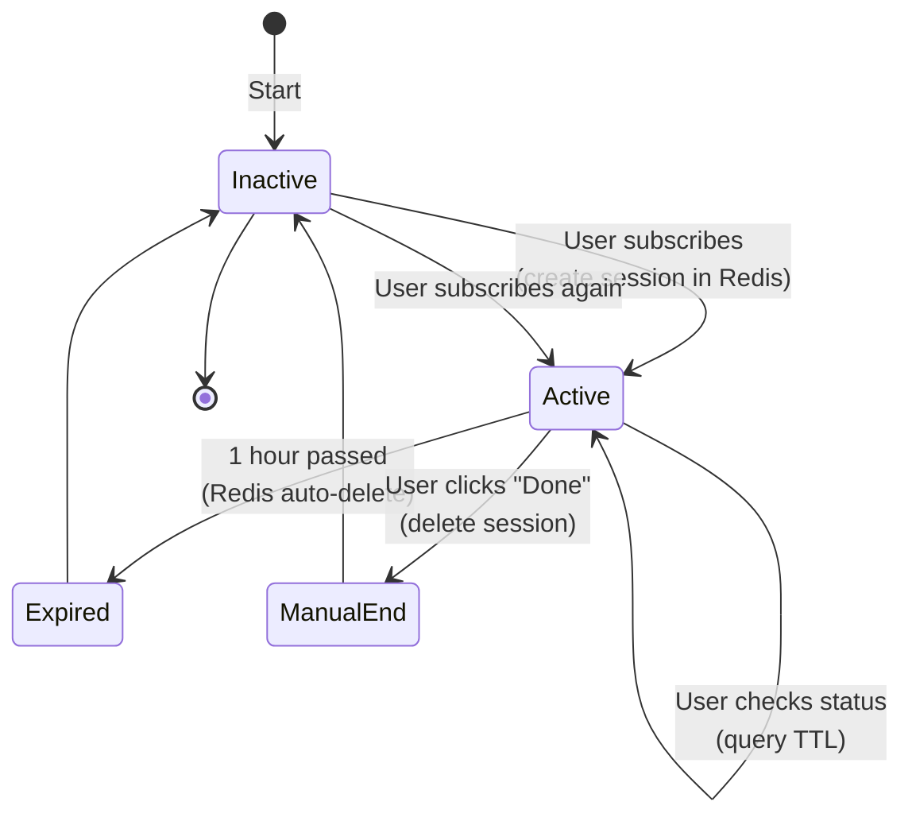

# Module 5: The Session Timer System

## The 60-Minute Window

"You have 1 hour to upload and convert as many files as you want. After 1 hour, the window resets."

This module explains how that window works at every layer.

---

## User Experience

```
1. User subscribes to "Hourly Plan"
   ↓
2. Timer starts: 60:00 remaining
   ↓
3. User uploads 5 PDFs in next 45 minutes
   ↓
4. Timer shows: 00:15 remaining (red background, flashing)
   ↓
5. User stops uploading at 10 minutes remaining
   ↓
6. Timer hits 00:00
   ↓
7. "Session expired. Subscribe again to continue."
   ↓
8. User subscribed again OR window resets if daily plan
```

---

## The Two-Layer Architecture

### Layer 1: Redis (Speed)

**Why**: Millisecond response times. User clicks "Check time" → instant response.

Redis stores two things per user:

```
session:{user_id}:start = "2024-01-15T10:30:00.000000"
  ↑ When the 1-hour window started
  ↑ TTL = 3600 seconds (auto-expires)
  ↑ Every request extends TTL to 3600 again
  
session:{user_id}:files = [job_42, job_43, job_44, job_45]
  ↑ Array of job IDs uploaded in this session
  ↑ Used to track "X files uploaded this window"
  ↑ Deleted when session expires
```

### Layer 2: PostgreSQL (Truth)

**Why**: Durability. If Redis restarts, we don't lose user sessions.

PostgreSQL stores:

```
Subscriptions table:
  id: 99
  user_id: 123
  plan_id: "hourly"
  is_active: true
  activated_at: "2024-01-15T10:30:00.000000"
  expires_at: "2024-01-16T10:30:00.000000"  (24 hours later)
  
Sessions table (separate):
  id: 999
  user_id: 123
  subscription_id: 99
  started_at: "2024-01-15T10:30:00.000000"
  file_count: 5
  ended_at: NULL (still active)
```

---

## Redis Keys: Detailed Breakdown

### Key 1: Session Start Time

```
Redis> SET session:123:start "2024-01-15T10:30:00.000000" EX 3600

Breakdown:
- pattern: session:{user_id}:start
- value: ISO timestamp (when window opened)
- EX 3600: Auto-expires after 3600 seconds = 1 hour
- If user inactive > 1 hour: Redis deletes automatically

Getting remaining time:
Redis> TTL session:123:start
  → 2847 (47 minutes 27 seconds remaining)

Resetting on new upload:
Redis> EXPIRE session:123:start 3600
  → Extends TTL back to 1 hour
```

### Key 2: Files in Current Session

```
Redis> LPUSH session:123:files job_42

Breakdown:
- pattern: session:123:files
- type: List (array)
- value: job IDs
- NO TTL (deletes when parent session expires)

Example state:
session:123:files = [
  "job_47",    ← Most recent upload
  "job_46",
  "job_45",
  "job_44",
  "job_42"     ← Oldest upload
]

Counting files:
Redis> LLEN session:123:files
  → 5 files uploaded this session

Displaying to user:
"You've uploaded 5 files in this session"
```

---

## Session Lifecycle: Step by Step

### Activation (Payment succeeds)

```python
def create_subscription_from_payment(payment):
    # PostgreSQL: Create subscription
    subscription = Subscription(
        user_id=123,
        plan_id="hourly",
        is_active=True,
        activated_at=datetime.now(),
        expires_at=datetime.now() + timedelta(hours=1)
    )
    db.add(subscription)
    db.commit()
    
    # Redis: Start session
    user_id = 123
    now = datetime.now().isoformat()
    
    redis.set(
        f"session:{user_id}:start",
        now,
        ex=3600  # 1 hour
    )
    
    # Redis: Initialize file list
    redis.delete(f"session:{user_id}:files")  # Fresh start
```

### During Session (User uploads)

```python
@app.post("/upload")
async def upload_file(
    file: UploadFile,
    current_user: User = Depends(get_current_user),
    ...
):
    # ... upload to MinIO, scan, queue task ...
    
    # When task queued successfully:
    job_id = job.id  # e.g., 42
    user_id = current_user.id
    
    # Push to Redis list
    redis.lpush(f"session:{user_id}:files", job_id)
    
    # Extend session TTL (every upload extends the window)
    redis.expire(f"session:{user_id}:start", 3600)
    
    return {"job_id": job_id, "status": "queued"}
```

### Checking Remaining Time

```python
@app.get("/session/status")
async def get_session_status(
    current_user: User = Depends(get_current_user),
    ...
):
    user_id = current_user.id
    
    # Check Redis
    session_key = f"session:{user_id}:start"
    remaining_ttl = redis.ttl(session_key)
    
    if remaining_ttl == -2:
        # Key doesn't exist (session not active)
        return {"has_session": False, "remaining_seconds": 0}
    
    if remaining_ttl > 0:
        # Session still active
        file_count = redis.llen(f"session:{user_id}:files")
        
        return {
            "has_session": True,
            "remaining_seconds": remaining_ttl,
            "remaining_formatted": format_seconds(remaining_ttl),
            "files_uploaded": file_count,
            "plan": "hourly"
        }
    
    # Fallback: check PostgreSQL
    sub = db.query(Subscription).filter(
        Subscription.user_id == user_id,
        Subscription.is_active == True
    ).first()
    
    if sub:
        # Subscription exists but Redis key missing
        # Re-create Redis session from PostgreSQL
        now = datetime.now().isoformat()
        redis.set(
            f"session:{user_id}:start",
            now,
            ex=3600
        )
        
        return {
            "has_session": True,
            "remaining_seconds": 3600,
            "message": "Session restored from backup"
        }
    
    return {"has_session": False}
```

### Expiration (Window closes, or no activity)

**Automatic expiration** (Redis):
```
1 hour has passed, no more requests
    ↓
Redis: session:123:start key expires (TTL=0)
    ↓
Session deleted automatically
    ↓
User's next request checks /session/status
    → has_session=false
    ↓
Frontend shows: "Session expired. Subscribe again."
```

**Manual expiration** (User-triggered):
```python
@app.post("/session/end")
async def end_session_early(
    current_user: User = Depends(get_current_user)
):
    # User paid for 1 hour, but done early
    redis.delete(f"session:{current_user.id}:start")
    redis.delete(f"session:{current_user.id}:files")
    
    return {"status": "Session ended manually"}
```

---

## Celery Beat: Sync Redis ↔ PostgreSQL

**Problem**: What if Redis crashes and restarts? We lose all sessions!

**Solution**: Every minute, sync Redis state to PostgreSQL.

```python
# celery_beat_config.py

from celery.schedules import crontab

app.conf.beat_schedule = {
    'sync-sessions': {
        'task': 'tasks.sync_active_sessions',
        'schedule': crontab(minute='*'),  # Every minute
    },
}
```

```python
# tasks.py

@app.task
def sync_active_sessions():
    """
    Every minute: sync Redis sessions to PostgreSQL.
    
    Purpose:
    - If Redis crashes, we can restore sessions from PostgreSQL
    - Audit trail: know how many sessions were active
    - Detect anomalies: user has Redis session but no subscription
    """
    
    # Get all active session keys from Redis
    session_keys = redis.keys("session:*:start")
    # Returns: ["session:123:start", "session:456:start", ...]
    
    for key in session_keys:
        # Extract user_id from key
        user_id = int(key.split(":")[1])
        
        # Get start time from Redis
        start_time_str = redis.get(key)
        start_time = datetime.fromisoformat(start_time_str)
        
        # Get file count from Redis
        file_count = redis.llen(f"session:{user_id}:files")
        
        # Check if session row exists in PostgreSQL
        existing_session = db.query(Session).filter(
            Session.user_id == user_id,
            Session.ended_at == None
        ).first()
        
        if existing_session:
            # Update existing
            existing_session.file_count = file_count
            existing_session.updated_at = datetime.now()
        else:
            # Create new
            subscription = db.query(Subscription).filter(
                Subscription.user_id == user_id,
                Subscription.is_active == True
            ).first()
            
            if subscription:
                session = Session(
                    user_id=user_id,
                    subscription_id=subscription.id,
                    started_at=start_time,
                    file_count=file_count,
                    ended_at=None
                )
                db.add(session)
        
        db.commit()
```

---

## Redis Persistence: AOF (Append-Only File)

**Problem**: Redis in memory. Server restarts? Sessions lost!

**Solution**: Enable AOF (Append-Only File) in redis.conf.

```
# docker-compose.yml
services:
  redis:
    image: redis:7
    command: redis-server --appendonly yes
    volumes:
      - redis_data:/data
```

**How it works**:
```
Every write to Redis:
  1. Operation added to AOF file (/data/appendonly.aof)
  2. AOF fsync'd to disk (every second by default)
  3. On restart, Redis replays AOF → recovers all sessions

Example AOF file:
  *3
  $3
  SET
  $19
  session:123:start
  $26
  2024-01-15T10:30:00.000000
  
  *3
  $5
  LPUSH
  $20
  session:123:files
  $6
  job_42
```

---

## State Machine: All Session States



---

## Troubleshooting: Session Issues

| Symptom | Diagnosis | Fix |
|---------|-----------|-----|
| **Timer shows 0m0s but should show 50m** | Redis key missing | Check: `redis-cli GET session:123:start` | Restart Celery Beat to sync Redis ↔ PostgreSQL. Or manual: `redis-cli SET session:123:start "ISO_TIME" EX 3600` |
| **Timer doesn't update (frozen at same time)** | Celery Beat not running | `docker logs beat` → check scheduled tasks | Restart Beat: `docker restart beat` |
| **Session resets suddenly in middle of upload** | TTL not extended on upload | Check upload handler: does it call `redis.expire(session_key, 3600)`? | Add TTL extend to upload handler |
| **Redis crashed, all sessions gone** | AOF not enabled | Check redis.conf: `appendonly yes` | Enable AOF, restart Redis. Future sessions persisted. |
| **User has active subscription but /session/status returns false** | Redis session key missing, but subscription in DB | Celery Beat should have recreated it. Check sync task logs | Run sync manually: `celery -A tasks call tasks.sync_active_sessions` |
| **File count incorrect (Redis says 5, user remembers 3)** | Race condition in LPUSH | Redis is single-threaded (shouldn't happen). Check app logs | Rebuild file count: `redis-cli DEL session:123:files`, re-query DB, re-populate list |

---

## Performance: Session Operations

```
GET /session/status:
  - redis.ttl() → <1ms
  - redis.llen() → <1ms
  - Total: ~2ms (cached, no DB hit)

POST /upload (session extend):
  - redis.expire() → <1ms
  - redis.lpush() → <1ms
  - Total: ~2ms
  
Celery Beat sync (every 60s):
  - redis.keys() → 2-10ms (O(N) scan)
  - N loop iterations (N = active sessions)
  - Each iteration: DB query (~5ms) + insert/update (~10ms)
  - Total: ~100-500ms for 10 active sessions
  - Safe to run at :00 seconds
```

---

## Cost Implications: Session Storage

```
Redis memory per session:
  session:123:start = 47 bytes (key + timestamp)
  session:123:files = 100 bytes + 8 per file
  
  Per user: ~150 bytes total

With 1000 concurrent users:
  1000 × 150 bytes = 150KB (negligible)
  
Redis overhead:
  ~1-2MB for 10,000 sessions (still tiny)
```

---

## Key Takeaways

- **Redis**: Session window (TTL auto-expires in 1 hour)
- **PostgreSQL**: Audit trail + recovery (Celery Beat syncs every minute)
- **TTL extension**: Every upload resets the 1-hour window
- **File tracking**: List of job IDs uploaded in this session
- **Celery Beat**: Sync task ensures durability on Redis restart
- **AOF persistence**: Redis survives server restart
- **State**: Active → Expired or Manual end
- **Total response time**: <10ms (user perceives instant)

Next module: Deploy this entire platform to a Hetzner VPS.
